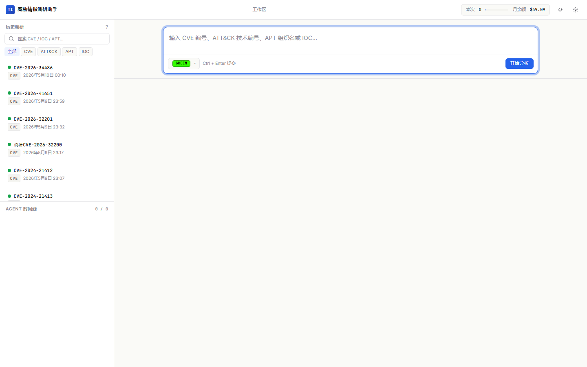
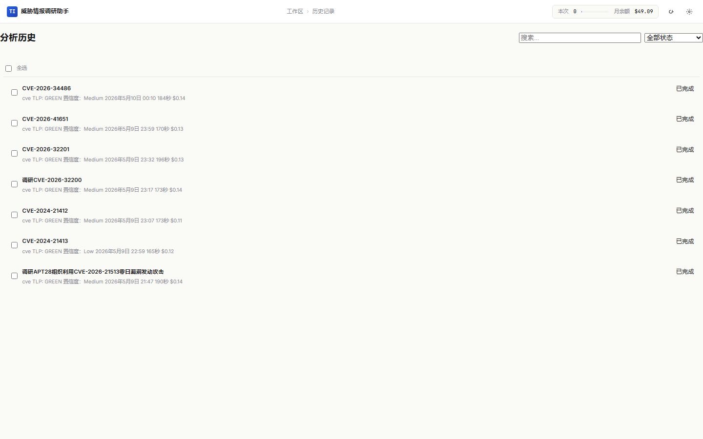
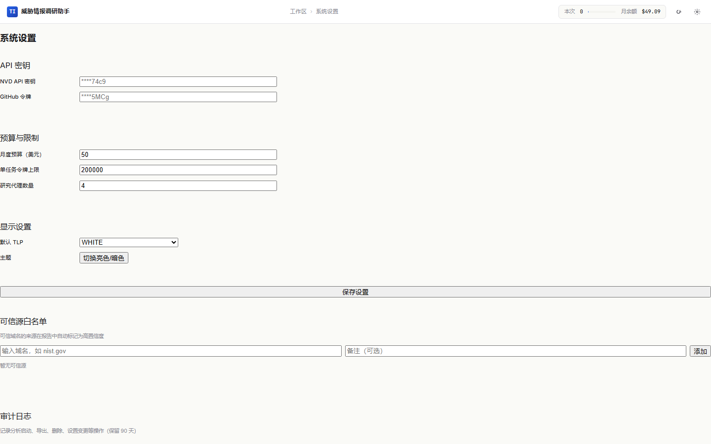
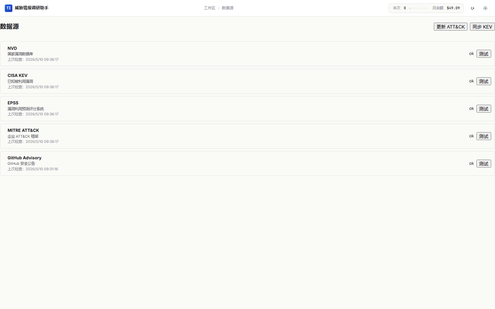

# Threat Intel Agent v0.9

企业级威胁情报深度调研平台。面向 SOC 分析师和安全研究人员，结合权威数据源与多 Agent 协同推理，一键生成结构化威胁情报报告。

---

## 目录

- [平台定位](#平台定位)
- [核心能力](#核心能力)
- [界面预览](#界面预览)
- [系统架构](#系统架构)
- [快速部署](#快速部署)
- [推荐模型](#推荐模型)
- [使用指南](#使用指南)
- [配置参考](#配置参考)
- [数据源](#数据源)
- [Agent 流水线](#agent-流水线)
- [导出格式](#导出格式)
- [API 参考](#api-参考)
- [安全机制](#安全机制)
- [技术栈](#技术栈)
- [项目结构](#项目结构)
- [测试](#测试)
- [版本更新](#版本更新)
- [许可证](#许可证)

---

## 平台定位

Threat Intel Agent 解决的核心问题是：**安全分析师面对一个 IOC、CVE、APT 组织或攻击手法时，如何在最短时间内产出高质量的情报调研报告。**

传统流程需要分析师手动查询 NVD、CISA KEV、MITRE ATT&CK、GitHub Advisory 等多个数据源，再综合整理成报告。这个过程通常需要 30 分钟到数小时。

本平台通过 **8-Agent 协同流水线** 自动完成全流程：

1. 理解查询意图并制定调研计划
2. 并行查询权威数据源与开源情报
3. 多路研究员同时调研并提交发现
4. 自动提取 IOC、映射 ATT&CK 技术、关联 CVE
5. 质量审查后生成结构化报告
6. 输出 STIX 2.1、Sigma 规则等标准化格式

从输入查询到获得完整报告，通常只需 **1-3 分钟**。

---

## 核心能力

### 多维度查询支持

| 查询类型 | 示例 | 说明 |
|----------|------|------|
| CVE 漏洞 | `CVE-2024-3094` | 单个或多个 CVE 深度分析 |
| ATT&CK 技术 | `T1059.001` | 攻击技术映射与关联分析 |
| APT 组织 | `APT29` | 威胁组织画像与攻击模式 |
| 恶意软件 | `Cobalt Strike` | 恶意软件家族行为分析 |
| IOC 指标 | `192.168.1.1`、`evil.com` | IP/域名/哈希/邮箱/文件路径 |
| 安全事件 | `SolarWinds 供应链攻击` | 安全事件全景分析 |
| 漏洞公告 | `CNVD-2024-00001` | 国内外漏洞公告调研 |
| 通用威胁 | `Log4Shell 影响范围` | 开放式威胁情报调研 |

### 5 大权威数据源

- **NVD**（国家漏洞数据库）— CVE 元数据、CVSS 评分、CWE/CPE
- **CISA KEV**（已知被利用漏洞目录）— 在野利用状态
- **EPSS**（漏洞利用预测评分）— 概率化风险评估
- **MITRE ATT&CK** — 攻击技术、战术、威胁组织映射
- **GitHub Advisory** — 开源组件安全公告

### 结构化输出

- **Markdown 报告** — 完整的分析结论与证据链
- **PDF 报告** — 专业排版的可分发文档
- **STIX 2.1 Bundle** — 标准化威胁情报交换格式
- **IOC CSV** — 可直接导入 SIEM 的指标列表
- **Sigma 规则** — 可部署的检测规则
- **ZIP 打包** — 一键导出全部格式

### 实时协作

- SSE 流式推送，分析全程可视化
- 支持意图切换（5 秒决策窗口）
- 支持任务中断与增量刷新
- Last-Event-ID 断线重连

---

## 界面预览

| 工作台 | 历史记录 |
|:---:|:---:|
|  |  |

| 系统设置 | 数据源 |
|:---:|:---:|
|  |  |

---

## 系统架构



```
┌─────────────────────────────────────────────────────┐
│                    前端 SPA                         │
│  workspace / history / settings / sources           │
├─────────────────────────────────────────────────────┤
│                  FastAPI 路由层                      │
│  analyze · stream · history · export · settings     │
├─────────────────────────────────────────────────────┤
│               8-Agent 协同流水线                     │
│  Intent → Plan → Enrich → Research → IOC            │
│           → Critic → Sigma → Synthesis              │
├──────────────────────┬──────────────────────────────┤
│    权威数据源        │        开源情报               │
│  NVD · KEV · EPSS   │    DuckDuckGo 搜索            │
│  ATT&CK · GHSA      │    网页内容提取               │
├──────────────────────┴──────────────────────────────┤
│            SQLite WAL · 异步持久化                   │
└─────────────────────────────────────────────────────┘
```

---

## 快速部署

### 环境要求

- Python 3.11+
- 网络环境可访问 LLM API 和数据源（或配置代理）

### 安装步骤

```bash
# 1. 克隆仓库
git clone https://github.com/Zer00n/threat-intel-agent.git
cd threat-intel-agent

# 2. 创建虚拟环境
python -m venv venv
source venv/bin/activate    # Windows: venv\Scripts\activate

# 3. 安装依赖
pip install -r requirements.txt

# 4. 配置环境变量
cp .env.example .env
# 编辑 .env，至少填写 ANTHROPIC_API_KEY

# 5. 初始化（创建数据库 + 下载 ATT&CK 数据）
python -m app.scripts.init

# 6. 启动服务
uvicorn app.main:app --host 127.0.0.1 --port 8000
```

浏览器访问 **http://127.0.0.1:8000** 即可使用。

### Windows 一键启动

双击 `start.bat` 自动完成上述全部步骤。

---

## 推荐模型

建议使用 **DeepSeek V4 Flash** 作为 LLM 后端。该模型具有极高的性价比和 1M token 上下文窗口，完全满足威胁情报深度推理的需求。

| 模型 | 输入价格 | 输出价格 | 上下文 | 说明 |
|------|---------|---------|--------|------|
| DeepSeek V4 Flash | ¥1 / 百万 token | ¥2 / 百万 token | 1M | **推荐**，性价比最优 |
| DeepSeek V4 Pro | ¥3.13 / 百万 token | ¥6.26 / 百万 token | 1M | 更强推理，适合复杂分析 |

**平台统一按 DeepSeek V4 Flash 价格计费**（¥1/百万输入 + ¥2/百万输出），无论实际使用何种模型，均可直观感受费用消耗。

### 配置示例

通过硅基流动（SiliconFlow）接入：

```bash
ANTHROPIC_API_KEY=sk-your-siliconflow-key
ANTHROPIC_BASE_URL=https://api.siliconflow.cn/v1
ANTHROPIC_MODEL=deepseek-ai/deepseek-v4-flash
API_FORMAT=openai
```

通过 DeepSeek 官方接入：

```bash
ANTHROPIC_API_KEY=sk-your-deepseek-key
ANTHROPIC_BASE_URL=https://api.deepseek.com/v1
ANTHROPIC_MODEL=deepseek-v4-flash
API_FORMAT=openai
```

通过 Anthropic 官方 API：

```bash
ANTHROPIC_API_KEY=sk-ant-your-key
API_FORMAT=anthropic
# ANTHROPIC_BASE_URL 留空使用官方端点
```

---

## 使用指南

### 发起分析

1. 在工作台顶部输入框中输入查询，例如：
   - `CVE-2024-3094` — 分析 XZ 后门漏洞
   - `APT29 攻击手法` — 调研 APT29 组织
   - `192.168.1.1` — 调查可疑 IP
   - `Log4Shell 最新影响` — 开放式威胁调研

2. 选择 TLP 级别（默认 GREEN），点击「开始分析」

3. 系统首先进行**意图识别**（约 5 秒），你可以在此期间切换分析意图

4. 分析过程中可随时点击「停止」中断任务

### 查看结果

- **分析报告**：Markdown 渲染的结构化报告
- **IOC 列表**：按类型分组的失陷指标，支持一键复制和 defang 开关
- **ATT&CK**：映射的攻击技术与战术矩阵
- **CVE 漏洞**：关联的漏洞信息（CVSS、KEV 状态、EPSS 评分）
- **数据来源**：所有引用的数据源及链接
- **调研轨迹**：完整的 Agent 执行日志，可展开查看每步详情

### 增量刷新

对已有报告点击「刷新增量」，系统会基于原报告上下文发起增量分析，保留历史对比。

### 导出报告

支持单条导出和批量导出：

| 格式 | 用途 |
|------|------|
| MD | Markdown 原文 |
| PDF | 可分发的排版文档 |
| STIX | 标准化威胁情报交换 |
| Sigma | SIEM 检测规则 |
| IOC CSV | 可导入安全工具的指标列表 |
| ZIP | 以上全部格式打包 |

### 费用管理

页面右上角实时显示：

- **已消耗**：当月累计费用（¥）
- **月余额**：当月剩余预算（¥）
- **进度条**：预算使用百分比

在「系统设置」中可调整月度预算和单任务令牌上限。

---

## 配置参考

所有配置通过 `.env` 文件或环境变量设置。

### 基础配置

| 变量 | 必填 | 默认值 | 说明 |
|------|:----:|--------|------|
| `ANTHROPIC_API_KEY` | 是 | — | LLM API 密钥 |
| `ANTHROPIC_BASE_URL` | 否 | — | 自定义 API 端点（第三方平台） |
| `ANTHROPIC_MODEL` | 否 | `baidu/cobuddy:free` | 模型名称 |
| `API_FORMAT` | 否 | `anthropic` | API 格式：`anthropic` 或 `openai` |
| `HTTP_PROXY` | 否 | — | 出站代理（http/https/socks5） |

### 数据源密钥

| 变量 | 说明 |
|------|------|
| `NVD_API_KEY` | NVD API 密钥，提升限流额度（40→5 请求/30 秒） |
| `GITHUB_TOKEN` | GitHub 令牌，启用 GitHub Advisory 查询 |

### 预算与性能

| 变量 | 默认值 | 说明 |
|------|--------|------|
| `MONTHLY_BUDGET_USD` | 50.0 | 月度预算（元） |
| `MONTHLY_BUDGET_CNY` | 300.0 | 月度预算（元），优先使用 |
| `SINGLE_TASK_TOKEN_LIMIT` | 900,000 | 单任务令牌上限 |

### Agent 参数

| 变量 | 默认值 | 说明 |
|------|--------|------|
| `RESEARCHER_COUNT_DEFAULT` | 4 | 并行研究 Agent 数量（1-5） |
| `RESEARCHER_MAX_ROUNDS` | 2 | 每个研究 Agent 最大迭代轮数 |
| `ENRICHMENT_TIMEOUT_S` | 15 | 数据源查询超时（秒） |
| `SYNTHESIS_TIMEOUT_S` | 120 | 报告生成超时（秒） |
| `ANALYSIS_TIMEOUT_S` | 600 | 整体分析超时（秒） |

### 其他

| 变量 | 默认值 | 说明 |
|------|--------|------|
| `DATABASE_URL` | `sqlite+aiosqlite:///./data/ti.db` | 数据库连接 |
| `DATA_DIR` | `./data` | 数据存储目录 |
| `ATTCK_BUNDLE_PATH` | `./data/attck/enterprise-attack.json` | ATT&CK 数据文件 |
| `LOG_LEVEL` | `INFO` | 日志级别 |
| `HOST` | `127.0.0.1` | 监听地址 |
| `PORT` | 8000 | 监听端口 |

### 代理配置

```bash
HTTP_PROXY=http://127.0.0.1:7890
# 或
HTTP_PROXY=socks5://127.0.0.1:7890
```

依赖中已包含 `httpx[socks]`，无需额外安装 SOCKS 支持。

---

## 数据源

| 数据源 | 类型 | 用途 | 需要密钥 |
|--------|------|------|:--------:|
| [NVD](https://nvd.nist.gov) | 漏洞库 | CVE 元数据、CVSS 评分、CWE/CPE | 推荐 |
| [CISA KEV](https://www.cisa.gov/known-exploited-vulnerabilities-catalog) | 漏洞目录 | 已知被利用漏洞状态 | 否 |
| [EPSS](https://www.first.org/epss/) | 风险评估 | 漏洞利用概率预测 | 否 |
| [MITRE ATT&CK](https://attack.mitre.org) | 攻击框架 | 技术、战术、组织映射 | 否 |
| [GitHub Advisory](https://github.com/advisories) | 安全公告 | 开源组件漏洞信息 | 是 |
| DuckDuckGo Search | 搜索引擎 | 开源情报检索 | 否 |

数据源页面（`/sources`）提供：
- 实时健康状态监控
- 单独测试连通性
- 手动更新 ATT&CK 数据和 KEV 目录
- 后台自动健康检查和缓存清理

---

## Agent 流水线

每次分析由 8 个专业 Agent 按序协作完成：

```
查询输入
  │
  ▼
┌──────────────────┐
│ 1. IntentClassifier │  识别意图，提取实体（CVE编号、IP、组织名等）
│    超时: 60s         │  支持用户 5 秒内切换意图
└────────┬─────────┘
         ▼
┌──────────────────┐
│ 2. PlannerAgent     │  根据意图制定调研计划，生成研究问题列表
│    超时: 60s         │
└────────┬─────────┘
         ▼
┌──────────────────┐
│ 3. EnrichmentAgent  │  并行查询权威数据源（NVD/KEV/EPSS/ATT&CK/GHSA）
│    超时: 15s         │  带降级策略，单个源失败不影响整体
└────────┬─────────┘
         ▼
┌──────────────────┐
│ 4. ResearchAgent ×N  │  N 个研究 Agent 并行调研（默认 4 个）
│    超时: 180s/个     │  每个独立搜索、提取、提交发现
└────────┬─────────┘
         ▼
┌──────────────────┐
│ 5. IOCExtractorAgent│  从报告和发现中提取所有 IOC（IP/域名/URL/哈希/邮箱）
│    超时: 60s         │
└────────┬─────────┘
         ▼
┌──────────────────┐
│ 6. CriticAgent       │  质量审查：检查遗漏、幻觉、结构完整性
│    超时: 90s         │
└────────┬─────────┘
         ▼
┌──────────────────┐
│ 7. SigmaGenerator   │  根据分析结论生成 Sigma 检测规则
│    超时: 60s         │
└────────┬─────────┘
         ▼
┌──────────────────┐
│ 8. SynthesisAgent    │  流式生成最终 Markdown 报告
│    超时: 120s        │
└────────┬─────────┘
         │
         ▼
    报告 + IOC + ATT&CK + CVE + Sigma
```

每个 Agent 均有独立超时保护，单个 Agent 失败不会导致整体崩溃。

---

## 导出格式

| 格式 | 文件 | 内容 |
|------|------|------|
| **Markdown** | `.md` | 完整调研报告原文 |
| **PDF** | `.pdf` | 专业排版，思源黑体，支持中英文混排 |
| **STIX 2.1** | `.json` | 标准 STIX Bundle，含 Indicator、Vulnerability、AttackPattern、TLP Marking |
| **IOC CSV** | `.csv` | 类型、值、defang 值、置信度、上下文；可过滤最低置信度和 defang |
| **Sigma** | `.yml` | SIEM 检测规则，LLM 生成，含 Sigma 模板兜底 |
| **ZIP** | `.zip` | 以上全部格式打包下载 |

---

## API 参考

### 分析

| 方法 | 路径 | 说明 |
|------|------|------|
| `POST` | `/analyze` | 启动分析 |
| `GET` | `/stream/{task_id}` | SSE 实时事件流 |
| `POST` | `/analyze/{id}/stop` | 停止运行中的分析 |
| `POST` | `/analyze/{id}/switch_intent` | 切换分析意图（5 秒窗口） |
| `POST` | `/analyze/{id}/refresh` | 基于已有报告增量刷新 |

### 历史

| 方法 | 路径 | 说明 |
|------|------|------|
| `GET` | `/history` | 历史列表（支持分页、搜索、筛选） |
| `GET` | `/history/{id}` | 分析详情（含 IOC、ATT&CK、CVE、轨迹） |
| `DELETE` | `/history/{id}` | 删除单条记录 |
| `POST` | `/history/batch_delete` | 批量删除 |
| `GET` | `/history/{id}/diff/{compare_id}` | 两份报告差异对比 |

### 导出

| 方法 | 路径 | 说明 |
|------|------|------|
| `GET` | `/export/md/{id}` | 导出 Markdown |
| `GET` | `/export/pdf/{id}` | 导出 PDF |
| `GET` | `/export/stix/{id}` | 导出 STIX 2.1 |
| `GET` | `/export/iocs/{id}` | 导出 IOC CSV |
| `GET` | `/export/sigma/{id}` | 导出 Sigma 规则 |
| `GET` | `/export/zip/{id}` | 打包导出全部格式 |
| `POST` | `/export/batch` | 批量导出 |

### 数据源

| 方法 | 路径 | 说明 |
|------|------|------|
| `GET` | `/sources/health` | 数据源健康状态 |
| `POST` | `/sources/test/{name}` | 测试指定数据源 |
| `POST` | `/sources/refresh_attck` | 更新 ATT&CK 数据 |
| `POST` | `/sources/refresh_kev` | 同步 KEV 目录 |

### 系统

| 方法 | 路径 | 说明 |
|------|------|------|
| `GET` | `/health` | 健康检查 |
| `GET` | `/stats` | 统计信息（分析数、费用、月度用量） |
| `GET` | `/settings` | 获取设置 |
| `PUT` | `/settings` | 更新设置 |
| `GET` | `/settings/trusted_sources` | 可信源白名单 |
| `POST` | `/settings/trusted_sources` | 添加可信源 |
| `DELETE` | `/settings/trusted_sources/{domain}` | 删除可信源 |

---

## 安全机制

### TLP 标记

每次分析均标记 TLP（Traffic Light Protocol）级别：

| 级别 | 含义 | 使用场景 |
|------|------|---------|
| TLP:CLEAR | 公开信息 | 已公开的漏洞和威胁情报 |
| TLP:GREEN | 社区共享 | 内部团队和合作伙伴 |
| TLP:AMBER | 受限分发 | 需要知情的安全社区 |
| TLP:AMBER+STRICT | 严格限制 | 仅限直接相关人员 |
| TLP:RED | 个人保密 | 仅限指定个人 |

### IOC Defang

所有提取的 IOC 自动进行 defang 处理，防止误触发安全工具：

- IP 地址：`192.168.1.1` → `192[.]168[.]1[.]1`
- 域名：`evil.com` → `evil[.]com`
- URL：`http://evil.com` → `hxxp://evil[.]com`

### 注入检测

查询输入经过注入模式检测，识别并记录可能的 Prompt 注入尝试。

### 数据安全

- 敏感配置（API Key 等）使用 AES-256 加密存储
- 前端设置页面自动遮蔽敏感字段
- 全部操作记录审计日志

---

## 技术栈

| 层级 | 技术 |
|------|------|
| **后端** | FastAPI + Python 3.11+ + SQLAlchemy async + SQLite WAL |
| **AI** | 多 Agent 协同，支持 Anthropic API 和 OpenAI 兼容格式 |
| **前端** | 原生 HTML/CSS/JS SPA + ti-* BEM 组件库（零框架依赖） |
| **PDF** | WeasyPrint + 思源黑体 |
| **数据库** | SQLite WAL 模式，FTS5 全文搜索 |
| **实时通信** | SSE（Server-Sent Events）+ Last-Event-ID 断线重连 |

---

## 项目结构

```
threat-intel-agent/
├── app/
│   ├── agents/                # Agent 流水线
│   │   ├── prompts/           # Agent 提示词模板
│   │   ├── enrichment/        # 数据源适配器（NVD/KEV/EPSS/ATT&CK/GHSA）
│   │   ├── orchestrator.py    # 流水线编排
│   │   ├── llm_client.py      # LLM 客户端（Anthropic/OpenAI 双格式）
│   │   ├── memory.py          # Agent 共享记忆
│   │   └── ...                # 各 Agent 实现
│   ├── db/
│   │   ├── models.py          # 数据库模型（13 张表）
│   │   ├── engine.py          # 异步引擎
│   │   └── repositories/      # 数据访问层
│   ├── exporters/             # 导出器（MD/PDF/STIX/CSV/Sigma/ZIP）
│   ├── routers/               # API 路由（6 个模块）
│   ├── utils/                 # 工具库（IOC 正则/defang/加密/ATT&CK）
│   ├── workers/               # 后台任务（健康检查/数据同步/缓存清理）
│   ├── schemas/               # 请求/响应模型
│   └── scripts/               # 初始化脚本
├── static/                    # 前端 SPA
│   ├── assets/                # CSS（tokens → components → app 三层）
│   ├── lib/                   # 核心 JS 模块
│   └── pages/                 # 页面组件
├── templates/pdf/             # PDF HTML 模板
├── tests/                     # 测试
└── start.bat                  # Windows 一键启动
```

---

## 测试

```bash
# 运行全部测试
pytest tests/ -v

# 运行指定模块
pytest tests/agent/ -v         # Agent 测试
pytest tests/api/ -v           # API 集成测试
```

---

## 版本更新

### v0.9

- **统一计费**：所有模型统一按 DeepSeek V4 Flash 价格计费（¥1/百万输入 + ¥2/百万输出）
- **费用中文化**：全平台费用显示从 `$` 改为 `¥`，预算单位统一为人民币
- **用量组件升级**：顶部 widget 显示「已消耗 ¥」和「月余额 ¥」，直观掌握预算
- **历史页面重构**：卡片式布局，统一使用 ti-* BEM 组件，对标数据源页面风格
- **推荐模型**：新增 DeepSeek V4 Flash 推荐配置

### v0.8

- 首次配置向导
- IOC 交互增强（点击 popover、defang 开关）
- ATT&CK 中文 tooltip
- 代理配置与缓存清理
- 测试覆盖提升

### v0.7

- Prompt 体系重构
- 意图分类扩展（20+ 类型）
- 计费中文化
- UI 导航修复

### v0.6

- 全新前端 UI（Inter 字体、冷蓝主色、light/dark 双主题）
- ti-* BEM 组件库（15+ 组件）
- 月度 Token 用量实时持久化

---

## 许可证

MIT License
